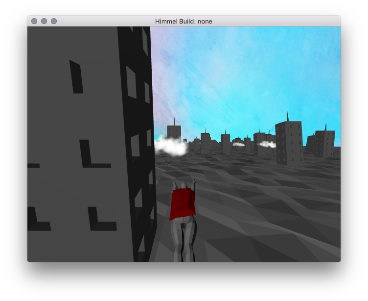

# Himmel
Game Programming WS15/16 project by Rudi Floren 318099, Kim Brose 322935, Sebastian Bockholt 322941

## Screenshot

## Instructions
You are a generic superhero flying through a city skyline!

Use *A* and *D* keys to move left or right respectively and evade buildings in your way.  
Use Esc to quit.

### Debug keys:
- *P* to switch to wireframe debug view
- *F* to show camera position

## Dependencies
- [GLFW](http://www.glfw.org/)
- GLM
- OpenGL
- ACGL
- json
- nanovg

## Build
Automated build using CMake with pkg-config.

Use the included bash script *./build.sh* for the simplest experience.  
The executable output is ./bin/Game
