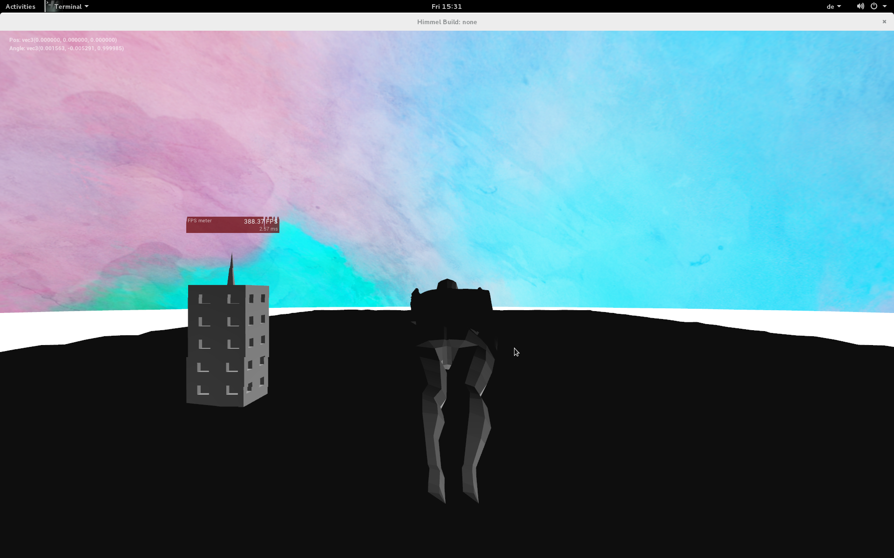

# Mockup vs Result


# Mockup vs Result


# Setup
- We had:
    - no experience in game programming or computer graphics
    - only basic understanding of C and Java (for OOP purposes)

# Team Setup
- Rudi:
    - basic engine functionality
    - render pipeline
    - terrain
    - shaders
- Sebastian:
    - cloth simulation
    - collision detection
    - level generation
- Kim:
    - cloud simulation


# Software Architecture
- used main loop: variable FPS and fixed ticks (64t/s)
- StatePattern for different states (play, menu, easily extendable)
- level storage via json files
- python script for level generation

# Class Diagram


# Debugging
## Problems
- We had problems with wrong facing normals
    - so we implemented a geometry shader for debugging

\centering
\includegraphics[height=0.6\textheight]{images/debug_view.png}


# Software Architecture
- depending libraries:
    - ACGL with its bundled libs
    - memononen/nanovg for a vector based graphical user interface
    - nlohmann/json as lightweight STL-compatible de/serializer for json


# Floor
- generated via triangulated perlin noise


# Cloth Simulation
- particle simulation with constraints
- Verlet integration
  - easy to add forces (wind, gravity, \dots)

. . .


```c
pos = pos + (pos-old_pos) + acceleration*STEPSIZE;
```


#Cloth Simulation
##Constraints
\includegraphics[height=0.3\textheight]{images/constraints}

. . .

```c
correction = (p1-p2)*(1 - rest_dist/current_dist); 
```
. . . 

- 5 iterations
  - more iterations $\Rightarrow$ higher stiffness

----

#Cloth Problems


#Cloth Problems


#Cloth Problems


#Cloth Problems


#Cloth Problems


# Collision Detection
## Cape $\leftrightarrow$ Hero collision
1. low poly model $\Rightarrow$ direct collision detection

. . . 

2. Approximation with spheres

\centering\includegraphics[height=0.5\textheight]{images/spheres}

# Collision Detection
## Hero $\leftrightarrow$ Building collision
- axis aligned bounding box

## Building $\leftrightarrow$ Building collision
- one level:
    - 15000-22000 Lines of json code, most objects

# Level Generation

1. randomly generated
    - no granted path

. . .

2. randomly generated **smartly**

. . .

\includegraphics[height=0.6\textheight]{images/levelgenerator}


# Cloud Simulation
## Goals
- semitransparent volumetric clouds
- react to player
- as correct as possible

## Solutions
- billboards
- fluid simulation, esp. viscosity

----

\centering\includegraphics[height=0.6\textheight]{images/5k_wolke}

# Performance Problems & Solutions
- spawning is unperformant
    - respawning
    - amount & size is set runtime (in level)
    - smoothing

. . .

- viscosity calculations are expensive
    - search grid
    - simplification

# Performance Problems & Solutions
- transparency blending requires sorting back to front
    - billboards are orthogonal to view direction
    - parallel to projection plane
    - sort by projection plane z

. . .

- preallocated vector as structure for sorting
- ParticleData consist of vec3 world position and vec4 color values and is sent to VAO

# Sorting Problems

\centering\includegraphics[height=0.6\textheight]{images/cloud_sorting}

# Cloud Shader Pipeline


# General Fails
- Nvidia light direction

